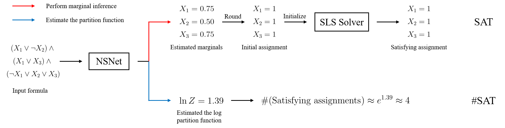

# Steps to download SATLIB & clean data

```bash
# --- DOWNLOAD SATLIB ---
# Ensore inside MSNet folder
% pwd
# OUT: /opt/files/maio2022/SAT/NSNet

# Run download (this) script -> specify output folder
python src/download_satlib_data.py /opt/files/maio2022/SAT/NSNet/SATSolving/SATLIB

# --- CLEAN DATA ---
# Ensure inside MSNet folser
# Clean data
python src/clean_data.py /opt/files/maio2022/SAT/NSNet/SATSolving/SATLIB


# --- Compile AllSAT solver ---
# (See section below re `MSNet/external/bdd_minisat_all`)

# --- GENERATE LABELS ---
# Ensore inside MSNet folder
% pwd
/opt/files/maio2022/SAT/NSNet

# Run label generator (this) script -> specify output folder
# Generates "marginals" using Minisat ALLSAT solver
#    (see page 6, point 4.1 in https://arxiv.org/pdf/2211.03880.pdf)
# WARNING: takes a loong time
% python src/generate_labels.py marginal /opt/files/maio2022/SAT/NSNet/SATSolving/SATLIB

```

#### Note about `labels`:

##### Page 2 (https://arxiv.org/pdf/2211.03880.pdf)

> Existing neural SAT solvers [ 2, 3] aim to predict a single satisfying assignment for a satisfiable formula. However, there can be multiple satisfying solutions, making it unclear which particular solution should be generated. Instead of directly predicting a solution, **NSNet performs marginal inference** in the solution space of a SAT problem, **estimating the assignment distribution of each variable among all satisfying assignments**.

> Although NSNet is not directly trained to solve a SAT problem, its estimated marginals can be used to quickly generate a satisfying assignment. One simple way is to **round the estimated marginals to an initial assignment and then perform the stochastic local search (SLS) on it**.

> Our experimental evaluations on the synthetic datasets with three different distributions show that NSNet’s initial assignments can not only **solve much more instances than both BP and the neural baseline but also improve the state-of-the-art SLS solver to find a satisfying assignment with fewer flips**.

##### Page 5

> To address this question, we leverage NSNet to perform **marginal inference**, i.e., **computing the marginal distribution of each variable among all satisfying assignments**. In other words, instead of solving a SAT problem directly, we aim to **estimate the fraction of each variable that takes 1 or 0 in the entire solution space**. Note the marginal for each variable takes all feasible solutions into account and is unique, which is more stable and interpretable to be reasoned by the neural networks. Similar to Equation 3 used by BP to compute variable beliefs, NSNet estimates each marginal value bi(xi) by aggregating the clause to variable assignment messages through a MLP and a softmax function: ...

> To train NSNet to perform marginal inference accurately, we minimize the Kullback-Leibler (KL) divergence loss between the estimated marginal distributions and the ground truth. We use an efficient ALLSAT solver to enumerate all the satisfying assignments and take the average of them to compute the true marginals.

> Now we consider how to generate a satisfying assignment after obtaining the estimated marginals. ...


### `AllSAT` solver needed to generate labels (*marginals*)

- http://www.sd.is.uec.ac.jp/toda/code/cnf2obdd.html#download
- https://arxiv.org/abs/1510.00523

Subdirectory `MSNet/external/bdd_minisat_all` should contain:
- `bdd_minisat_all.py`
- `bdd_minisat_all` --> executable & compiled for current OS/machine

##### Downloading & compiling `AllSAT` solver -> inside `MSNet/external/bdd_minisat_all` directory:

```bash
# Lib to prevent "/usr/bin/ld: cannot find -lz"
sudo apt install zlib1g-dev
# Delete executable compiled on different OS/machine
rm bdd_minisat_all
# Downlaod latest
wget http://www.sd.is.uec.ac.jp/toda/code/bdd_minisat_all-1.0.2.tar.gz
tar -xvzf bdd_minisat_all-1.0.2.tar.gz
cd bdd_minisat_all-1.0.2
make
cp bdd_minisat_all ./../bdd_minisat_all
# Clean-up
cd ..
rm -rf bdd_minisat_all-1.0.2
rm bdd_minisat_all-1.0.2.tar.gz
```


# Steps to generate labels

```bash
# Ensore inside MSNet folder
% pwd
/opt/files/maio2022/SAT/NSNet

# Run label generator (this) script -> specify output folder
# Generates "marginals" using Minisat ALLSAT solver
#    (see page 6, point 4.1 in https://arxiv.org/pdf/2211.03880.pdf)
% python src/generate_labels.py marginal /opt/files/maio2022/SAT/NSNet/SATSolving/SATLIB
```


# Package installs / requirements

#### `py-aiger` & `py-aiger-cnf` (circuits encoded using **`and` & `inverter` gates (AIGs)**) (requirements for python-sat)

- pyAiger: A python library for manipulating sequential and combinatorial circuits **encoded using `and` & `inverter` gates (AIGs)**.
  - https://github.com/mvcisback/py-aiger#installation
- py-aiger-cnf: Python library to convert between AIGER and CNF
  - https://github.com/mvcisback/py-aiger-cnf


```bash
mamba install toposort bidict funcy       # requirements for py-aiger
pip install py-aiger py-aiger-cnf
```

#### `PySAT` (`python-sat`) - PySAT: SAT technology in Python (requirement for current lib)

PySAT is a Python toolkit, which aims at providing a simple and unified interface to a number of state-of-art Boolean satisfiability (SAT) solvers as well as to a variety of cardinality and pseudo-Boolean encodings. The purpose of PySAT is to enable researchers working on SAT and its applications and generalizations to easily prototype with SAT oracles in Python while exploiting incrementally the power of the original low-level implementations of modern SAT solvers.

- https://github.com/pysathq/pysat
- https://pysathq.github.io/

```bash
pip install python-sat
```

#### `CNFGen` for generating CNF formulas

- https://github.com/MassimoLauria/cnfgen

```
pip install cnfgen
```


#### Other requirements

```bash
mamba install pytorch_geometric sympy networkx
```


# NSNet



This is the official PyTorch implementation of the paper

[NSNet: A General Neural Probabilistic Framework for Satisfiability Problems](https://arxiv.org/pdf/2211.03880.pdf)</br>
[Zhaoyu Li](https://www.zhaoyu-li.com) and [Xujie Si](https://www.cs.mcgill.ca/~xsi/)</br>
In *36th Conference on Neural Information Processing Systems (NeurIPS 2022)*.

## Installation

Our implementation is mainly based on Python 3.8, PyTorch 1.11.0, and PyG 2.0.4.

Since our codebase includes some external repositories, you can use the following line to clone the repository:

```bash
git clone --recurse-submodules https://github.com/zhaoyu-li/NSNet.git
```

To compile/use some external solvers (DSHARP[^1], MIS[^2]), you may use the following lines to set up:

```bash
# install GMP and Boost libraries for DSHARP and MIS
sudo apt-get install libgmp3-dev libboost-all-dev
cd NSNet/external/MIS
make
cd ../..
```

One can then install other dependencies to a virtual environment using the following lines:

```bash
pip install torch==1.11.0
pip install torch-geometric==2.0.4 torch-scatter==2.0.9 torch-sparse==0.6.13
pip install -r requirements.txt
```

## Reproduction

We provide scripts to generate/download the SAT and #SAT datasets and train/evaluate NSNet and other baselines for both SAT and #SAT problems.

To obtain the SAT and #SAT datasets, you may first use the following scripts:

```bash
# replace ~/scratch/NSNet in the following scripts to your own data directory
bash scripts/sat_data.sh
bash scripts/mc_data.sh
```

To train and evaluate a specific model on a SAT dataset without local search, you may try or modify these scripts:

```bash
# test BP on the SR dataset
bash scripts/sat_bp_sr.sh

# train and test NSNet on the 3-SAT dataset
bash scripts/sat_nsnet_3-sat.sh

# train and test NeuroSAT on the CA dataset
bash scripts/sat_neurosat_ca.sh
```

Note that each of the above scripts evaluates a model on both same-size and larger instances as training. NSNet and NeuroSAT are also trained in two settings (with marginal supervision/assignment supervision).

To test a specific model on a SAT dataset with local search (i.e., combine a model with the SLS solver Sparrow), you may try these scripts:

```bash
# test Sparrow using BP as the initialization method on the SR dataset
bash scripts/sat_bp-sparrow_sr.sh

# test Sparrow using NSNet as the initialization method on the 3-SAT dataset
# one may modify the checkpoint path in the script
bash scripts/sat_nsnet-sparrow_3-sat.sh

# test Sparrow using NeuroSAT as the initialization method on the CA dataset
# one may modify the checkpoint path in the script
bash scripts/sat_neurosat-sparrow_ca.sh
```

To train/evaluate a specific approach on a #SAT dataset, you may try or modify these scripts:

```bash
# test ApproxMC3 on the BIRD benchmark
bash scripts/mc_approxmc3_bird.sh

# train and test NSNet on the BIRD benchmark
bash scripts/mc_nsnet_bird.sh

# test F2 on the SATLIB benchmark
bash scripts/mc_f2_satlib.sh
```

For the neural baseline BPNN, we run it using the official implementation[^3], training and testing in the same setting as NSNet.

## Citation

If you find this codebase useful in your research, please consider citing the following paper.

```bibtex
@inproceedings{li2022nsnet,
  title={{NSN}et: A General Neural Probabilistic Framework for Satisfiability Problems},
  author={Zhaoyu Li and Xujie Si},
  booktitle={Advances in Neural Information Processing Systems (NeurIPS)},
  year={2022},
}
```

[^1]: https://github.com/QuMuLab/dsharp
[^2]: https://github.com/meelgroup/mis
[^3]: https://github.com/jkuck/BPNN
